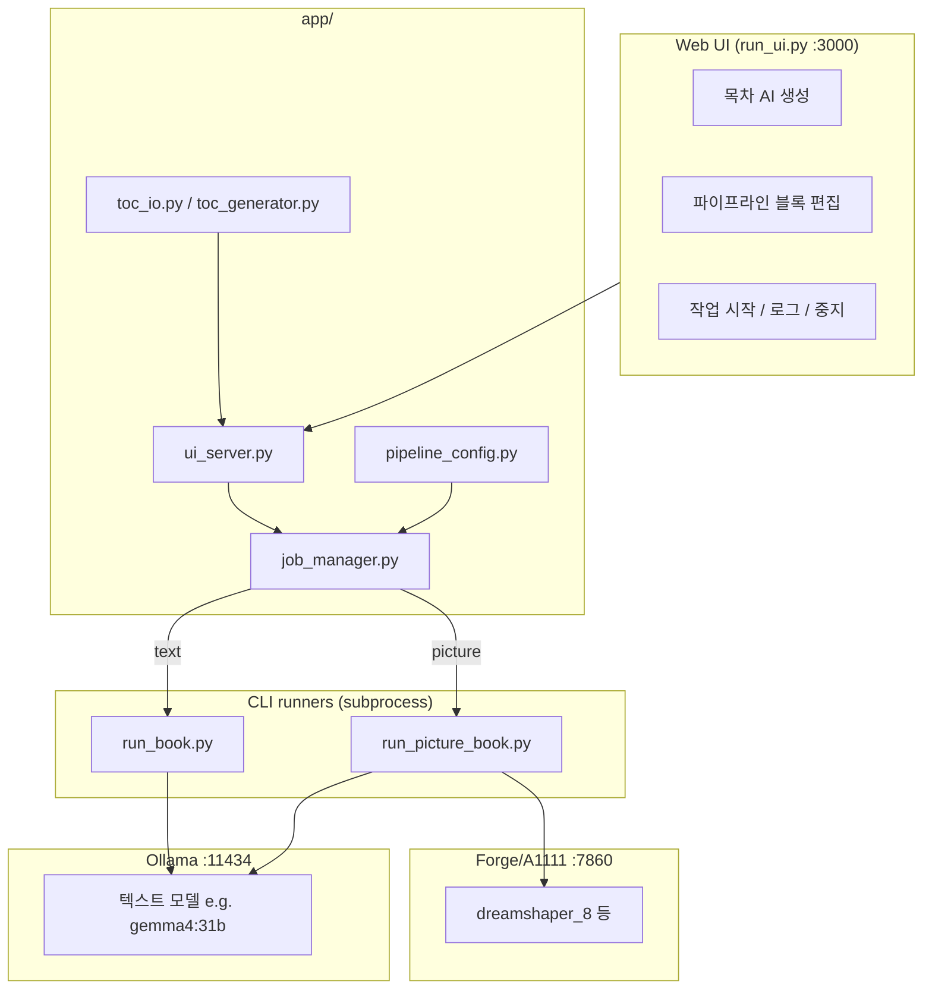
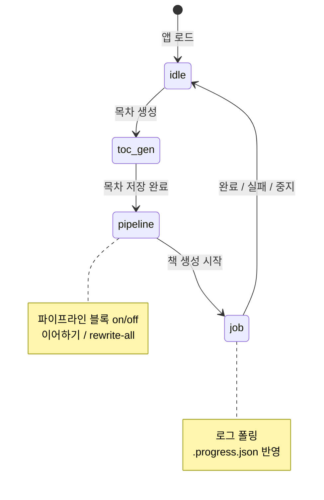
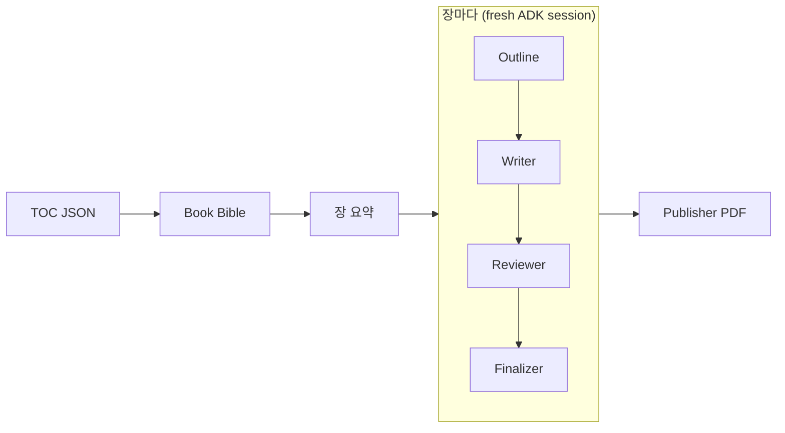
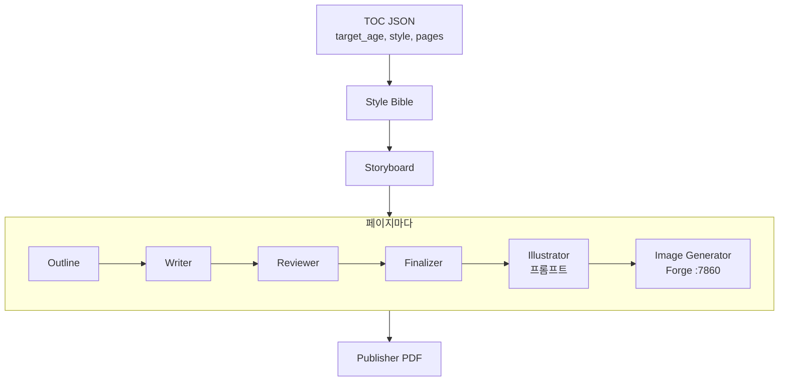

# Book Writing Agent

An AI agent that writes entire books overnight using locally-running LLM models via [Ollama](https://ollama.com/). Give it a table of contents, start it before bed, and wake up to a finished book committed to GitHub chapter by chapter.

Built with [Google ADK](https://github.com/google/adk-python) (Agent Development Kit).

Based on [prof-lijar/orchast_agent/book-writer](https://github.com/prof-lijar/orchast_agent/tree/master/book-writer).

## 목차

- [Architecture Overview](#architecture-overview) 텍스트/그림책 구조·에이전트 파이프라인
- [Getting Started](#getting-started) 설치·사전 요구사항
- [Web UI](#web-ui) 브라우저 UI·[시연 영상](#시연-영상-demos)
- [Usage (CLI)](#usage-cli) 텍스트 책 CLI
- [CLI Reference](#cli-reference) `run_book.py` 옵션
- [Project Structure](#project-structure) 디렉터리 구조
- [Picture Book Pipeline](#picture-book-pipeline) 그림책·이미지·PDF
- [Technology Stack](#technology-stack)
- [Troubleshooting](#troubleshooting)

---

## Architecture Overview

이 프로젝트는 **문서 책**과 **일러스트 책**을 지원합니다.

### 전체 구조



### UI 워크플로 (가운데 「생성 진행」)



### 텍스트 책 에이전트 (`app/agent.py`)

| 단계 | 에이전트 | 역할 | 실행 단위 |
|------|----------|------|-----------|
| 셋업 | **Book Bible** | 톤·독자·용어·일관성 가이드 | 책 1회 |
| 셋업 | **장 요약** | 각 장 1문단 요약 (이후 장 맥락용) | 책 1회 |
| 반복 | **Outline** | 장별 상세 개요 (Markdown) | 장마다 |
| 반복 | **Writer** | 개요 기반 본문 집필 | 장마다 |
| 반복 | **Reviewer** | 퇴고·개선본 출력 | 장마다 |
| 반복 | **Finalizer** | 최종 Markdown 정리 | 장마다 |
| 마무리 | **Publisher** | 장 합쳐 PDF 생성 | 책 1회 |



- 장마다 **새 ADK 세션** → 긴 책(20장+)에서 컨텍스트 넘침 방지  
- 진행 상태: `book/<slug>/.progress.json`  
- 파이프라인 블록은 TOC JSON의 `pipeline` 필드 + UI에서 저장 가능

### 일러스트 책 에이전트 (`app/picture_agent.py`)

일러스트 책은 **페이지마다 글 + 일러스트가 붙는 책**입니다.  
`target_age`(대상 연령)에 따라 **글 분량·문체·그림 톤**이 달라집니다 (예: `18세 이상`이면 여러 단락 산문 OK).

| 단계 | 에이전트 | 역할 | 실행 단위 |
|------|----------|------|-----------|
| 셋업 | **Style Bible** | 캐릭터·색감·화풍 가이드 | 책 1회 |
| 셋업 | **Storyboard** | 페이지별 장면·구도 JSON | 책 1회 |
| 반복 | **Outline** | 페이지 본문 개요 | 페이지마다 |
| 반복 | **Writer** | 개요 기반 집필 | 페이지마다 |
| 반복 | **Reviewer** | 퇴고·개선 | 페이지마다 |
| 반복 | **Finalizer** | 최종 본문 정리 | 페이지마다 |
| 반복 | **Illustrator** | Forge용 영문 이미지 프롬프트 | 페이지마다 |
| 반복 | **Image** | Forge/A1111·diffusers·Ollama 이미지 생성 | 페이지마다 |
| 마무리 | **Publisher** | 글+그림 PDF | 책 1회 |



**한 페이지 처리 순서:** 개요 → 집필 → 퇴고 → 마무리 → 그림 프롬프트 → 이미지 생성 (페이지마다 반복). 전체 글을 먼저 쓰고 나중에 그림만 그리는 방식이 **아님**.

**Style Bible 입력 (목차만 사용, 1회):** `title`, `description`, `target_age`, `style`, `characters`, `writing_guidelines`, `language`. 페이지별 `scene`/`mood`는 **포함하지 않음** (스토리보드 단계에서 사용).

**Storyboard 입력:** 위 목차 필드 + 생성된 Style Bible + 모든 페이지 `scene`/`mood`.

### 텍스트 vs 그림책, 에이전트가 다른 이유

| | 텍스트 책 | 그림책 |
|---|-----------|--------|
| 단위 | **장** (수천 단어) | **페이지** (연령별 가변 분량) |
| 핵심 출력 | Markdown 장 | 본문 + PNG + PDF |
| 집필 에이전트 | outline → writer → reviewer → finalizer (동일 4단계) | outline → writer → reviewer → finalizer |
| 시각 단계 | 없음 | illustrator + image |

같은 Ollama 모델을 쓰더라도 **프롬프트·단계·출력 형식**이 달라서 파이프라인을 분리했습니다.

---

## Getting Started

### Prerequisites

- Python 3.11+
- [Ollama](https://ollama.com/download) installed and running
- An Ollama model pulled (e.g. `ollama pull gemma4:31b`, `ollama pull qwen3.5:0.8b`)

### Install

```bash
pip install -e .
```

Or with [uv](https://docs.astral.sh/uv/):

```bash
uv sync
```

---

## Web UI

브라우저에서 목차 생성·수정, 파이프라인 편집, 책 생성, 진행 로그, 출력물 삭제를 할 수 있습니다.

### 시연 영상 (Demos)

단계별 화면 녹화는 GitHub Issue에 올리고, 아래 링크로 연결합니다.

| # | 단계 | 내용 | 영상 (GitHub Issue) |
|---|------|------|---------------------|
| 1 | **목차 선택·생성** | 책 종류(텍스트/그림책)·모델 선택 → AI 목차 생성 또는 기존 `*-toc.json` 선택 → 가운데 파이프라인 확인 | *(이슈 링크)* |
| 2 | **책 생성** | 파이프라인 블록 조정·저장 → 책 생성 시작 → 로그·진행률 → 출력물 미리보기/PDF | *(이슈 링크)* |

**시연 1: 목차 선택 또는 생성, 시스템 및 모델 관리**

- 왼쪽 **책 기획**: `book-type`, Ollama 모델, 목차 AI 생성 폼
- **목차 파일** 드롭다운으로 `toc/` 아래 목차 전환
- 가운데 **생성 진행**: 선택한 목차에 맞는 파이프라인(텍스트 vs 그림책) 표시

> 🎬 영상: 

**시연 2: 목차 관리, 사용 에이전트 조정, 책 생성**

- 생성된 파이프라인을 보고 on/off → **파이프라인 저장** (목차 JSON `pipeline` 반영)
- **이어하기** / **다시 생성** 옵션 → **책 생성 시작**
- 작업 로그, `.progress.json` 진행, 오른쪽 출력·PDF

> 🎬 영상: 

```bash
# 터미널 1: Ollama 터널 (원격 서버 글 생성)
ssh -N -L 11434:localhost:11434 user@remote-host

# 터미널 2: Forge (로컬 그림, webui-user.bat에 --api --listen)
cd /path/to/stable-diffusion-webui-forge   # Windows: C:\path\to\stable-diffusion-webui-forge
./webui.sh --api --listen                  # Windows: webui-user.bat

# 터미널 3: UI 실행
cd book-writing-agent
python run_ui.py
```

브라우저: **http://localhost:3000**

| 영역 | 기능 |
|------|------|
| **왼쪽, 책 기획** | 책 종류(텍스트/그림책), 모델 선택, 목차 AI 생성, 목차 파일 선택 |
| **가운데, 생성 진행** | 목차 생성 상태 → 파이프라인 블록 → 작업 로그·진행률 |
| **목차 관리 모달** | 제목·설명·장/페이지 추가·삭제·순서 변경·`target_age` |
| **파이프라인 블록** | 에이전트 on/off, TOC JSON `pipeline` 필드에 저장 |
| **작업 옵션** | 이어하기 (`--resume`), 전체/특정 번호 다시 생성 (`--rewrite-all` / `--rewrite`) |
| **오른쪽** | 출력물 미리보기·PDF 다운로드·삭제, Forge/Ollama 상태 |

### 파이프라인 기본 블록

**텍스트 책:** Book Bible → 장 요약 → [장마다] 개요·집필·퇴고·마무리 → PDF

**그림책:** Style Bible → 스토리보드 → [페이지마다] 개요·집필·퇴고·마무리·그림 프롬프트 → [페이지마다] 이미지 생성 → PDF

블록 설정은 `app/pipeline_config.py`의 기본값이며, UI에서 끄거나 `+ 추가`로 다시 넣을 수 있습니다. **책 생성 시작** 시 현재 UI 설정이 목차 JSON `pipeline` 필드에 저장된 뒤 작업에 전달됩니다.

그림책 기본 `pipeline` 예시:

```json
"pipeline": {
  "style_bible": true,
  "storyboard": true,
  "agents": ["outline", "writer", "reviewer", "finalizer", "illustrator"],
  "image": true,
  "publisher": true
}
```

- 예전 목차의 `page_writer`는 `writer`로 자동 매핑됩니다.
- `illustrator`만 켜져 있으면 **글 체인(개요~마무리)이 자동으로 보완**됩니다. 그림 프롬프트는 `page_text`가 필요하기 때문입니다.
- 로그 첫 줄의 `Agents:`에 `outline,writer,reviewer,finalizer,illustrator`가 보이는지 확인하세요. `illustrator`만 있으면 잘못된 설정입니다.
- 코드·UI 변경 후에는 `python run_ui.py` 재시작과 브라우저 **F5**가 필요합니다.

**출력물 삭제:** 실행 중인 해당 폴더 작업을 먼저 중지한 뒤 삭제합니다. `picture-book.log`가 에디터에서 열려 있으면 Windows에서 삭제가 실패할 수 있습니다.

---

## Usage (CLI)

### 1. Create a Table of Contents

**JSON** (recommended):

```json
{
  "title": "Mastering Python",
  "description": "A comprehensive guide to Python programming",
  "chapters": [
    {
      "number": 1,
      "title": "The Python Philosophy",
      "description": "History of Python, the Zen of Python, and why design choices matter"
    },
    {
      "number": 2,
      "title": "Advanced Data Structures",
      "description": "Deques, namedtuples, defaultdict, Counter, and when to use each"
    }
  ]
}
```

See `toc/sample-toc.json` for a working example.

### 2. Run the Agent

**Basic run** (writes to `./book/`):

```bash
python run_book.py --toc toc/sample-toc.json --model gemma4:31b --no-push
```

**Resume after interruption**:

```bash
python run_book.py --toc toc/sample-toc.json --model gemma4:31b --resume --no-push
```

**Full pipeline + publish to PDF**:

```bash
python run_book.py --toc toc/sample-toc.json --model gemma4:31b --agents outline,writer,reviewer,finalizer,publisher --no-push
```

### 3. Interactive Mode (ADK Playground)

```bash
agents-cli playground --port 8080
```

Open `http://localhost:8080` and select the `app` agent.

---

## CLI Reference

```
python run_book.py --toc TOC [--model MODEL] [options]

Required:
  --toc TOC              Path or GitHub URL to table of contents file (JSON, YAML, or text)
  --model MODEL          Ollama model name (required when running LLM agents)

Options:
  --output-dir DIR       Output directory (default: ./book)
  --branch BRANCH        Git branch name (default: main)
  --repo URL             Git remote repository URL
  --retry N              Retries per chapter on failure (default: 3)
  --words RANGE          Target word count per chapter (default: 3000-5000)
  --timeout SECONDS      Timeout per chapter in seconds (default: 1800)
  --stream               Stream LLM output to console in real-time
  --no-think             Disable model thinking (recommended for qwen3 models)
  --num-ctx N            Context window size (default: 32768)
  --repeat-penalty N     Repetition penalty (default: 1.2)
  --agents STAGES        Pipeline stages (default: outline,writer,reviewer,finalizer,publisher)
  --no-bible             Skip Book Bible setup
  --no-chapter-summary   Skip per-chapter summary setup
  --lang CODE            Language for book content (e.g. ko, es, fr)
  --rewrite N [N ...]    Rewrite specific chapter(s)
  --rewrite-all          Rewrite all chapters from scratch
  --skip N [N ...]       Skip specific chapter(s)
  --resume               Resume from .progress.json
  --no-push              Skip git operations (save files only)
```

---

## Project Structure

```
book-writing-agent/
├── app/
│   ├── agent.py              # 텍스트 책 ADK (book_bible/chapter_summary + outline/writer/reviewer/finalizer)
│   ├── picture_agent.py      # 그림책 ADK (style_bible/storyboard + 페이지 4단계 + illustrator)
│   ├── pipeline_config.py    # 파이프라인 기본값·정규화·CLI 인자 변환
│   ├── ui_server.py          # Web UI FastAPI (목차·작업·모델·출력 API)
│   ├── job_manager.py        # CLI 백그라운드 실행·로그 tail·작업 중지
│   ├── toc_generator.py      # Ollama 목차 AI 생성
│   ├── toc_io.py             # 목차 import/export/편집·pipeline 저장
│   ├── image_backends.py     # Forge/A1111, diffusers, Ollama 이미지
│   ├── picture_tools.py      # 그림책 TOC·연령별 가이드·PDF(WeasyPrint/fpdf2)
│   ├── book_context.py       # Book Bible·장 요약 저장/로드
│   ├── tools.py              # 텍스트 책 파일·진행·git
│   ├── log_setup.py          # Windows UTF-8 로깅·picture-book.log
│   ├── system_info.py        # Ollama/Forge 상태·목차 파일 목록
│   ├── output_manager.py     # 출력물 목록·삭제(잠긴 파일 처리)
│   ├── model_manager.py      # Ollama/Forge 모델 삭제 API
│   └── checkpoint_downloader.py
├── static/
│   └── index.html            # Web UI (파이프라인 빌더·워크플로·로그·PDF 미리보기)
├── run_ui.py                 # UI 서버 진입점 (:3000)
├── run_book.py               # 텍스트 책 CLI
├── run_picture_book.py       # 그림책 CLI
├── toc/                      # 목차 (기획) JSON — AI 생성·가져오기 기본 저장
│   ├── sample-toc.json       # 텍스트 책 예시
│   ├── sample-picture-toc.json
│   └── *-toc.json            # 하위 폴더까지 UI에서 검색
├── book/                     # 텍스트 책 출력
├── picture-book/             # 그림책 출력
└── pyproject.toml
```

---

## Picture Book Pipeline

Illustrated books (text + art per page). Text via **Ollama**; images via **Forge/A1111**, **diffusers**, or **Ollama image** (platform-dependent).  
Page text length and illustration tone follow **`target_age`** in the TOC (not limited to toddler board books).

### Image Backends

| Backend | Linux | Windows | 설명 |
|---------|-------|---------|------|
| **`automatic1111`** (기본) | ✅ | ✅ | Linux 서버에 Forge/A1111 설치 + SSH 터널 |
| **`diffusers`** | ✅ | ✅ | Python에서 직접 SD 1.5 생성 (로컬 GPU) |
| **`ollama`** | ❌ | ❌ | macOS 전용 (Ollama 이미지 모델) |

### Linux 서버 + SSH 터널 (권장)

**터미널 1: Ollama (텍스트):**
```bash
ssh -N -L 11434:localhost:11434 user@server
```

**터미널 2: Stable Diffusion WebUI/Forge (이미지):**
```bash
ssh -N -L 7860:localhost:7860 user@server
```

**서버에서 SD WebUI/Forge 실행 (최초 1회):**
```bash
# Forge 예시 (https://github.com/lllyasviel/stable-diffusion-webui-forge)
git clone https://github.com/lllyasviel/stable-diffusion-webui-forge
cd stable-diffusion-webui-forge
./webui.sh --api --listen
```

그림책용 체크포인트 추천: `dreamshaper_8`, `toonyou_beta6` (아동 일러스트 스타일)

**Windows PC (Ollama 터널 + 로컬 Forge):**

```powershell
# 터미널 1: Ollama SSH 터널
ssh -N -L 11434:localhost:11434 user@server

# 터미널 2: Forge (webui-user.bat에 --api --listen)
cd C:\path\to\stable-diffusion-webui-forge
webui-user.bat

# 터미널 3: 그림책 실행
cd book-writing-agent
python run_picture_book.py --toc toc/sample-picture-toc.json --model gemma4:31b --no-push
```

Forge UI에서 체크포인트를 하나 로드해 두세요. 비어 있으면 이미지 API가 500을 반환할 수 있습니다.

### 데스크탑 GPU만 사용 (diffusers)

RTX 2060 등 로컬 GPU에서 이미지까지 생성:
```bash
pip install book-writing-agent[images]
python run_picture_book.py --toc toc/sample-picture-toc.json --model llama3:8b \
  --image-backend diffusers --no-push
```

### Usage

```bash
# 전체 파이프라인: Linux 서버 SD + Ollama (터널 2개 열린 상태)
python run_picture_book.py --toc toc/sample-picture-toc.json --model llama3:8b --no-push

# 로컬 GPU로 이미지 생성
python run_picture_book.py --toc toc/sample-picture-toc.json --model llama3:8b \
  --image-backend diffusers --no-push

# 글만 먼저 (이미지 없이 테스트)
python run_picture_book.py --toc toc/sample-picture-toc.json --model llama3:8b \
  --agents style_bible,storyboard,outline,writer,reviewer,finalizer,illustrator --no-push

# 기존 페이지에 이미지만 생성
python run_picture_book.py --toc toc/sample-picture-toc.json \
  --agents image,publisher --no-push

# 중단 후 재개
python run_picture_book.py --toc toc/sample-picture-toc.json --model llama3:8b --resume --no-push

# 전체 페이지 다시 생성 (Style Bible·스토리보드 유지, 본문·이미지만)
python run_picture_book.py --toc toc/sample-picture-toc.json --model llama3:8b --resume --rewrite-all --no-push
```

Web UI에서도 **이어하기**, **전체 페이지 다시 생성**, **특정 페이지 번호** 옵션을 제공합니다 (파이프라인 확인 화면). `--resume`과 함께 쓰면 셋업 파일(`style-bible.md`, `storyboard.json`)은 유지됩니다.

### Picture Book TOC Format

See `toc/sample-picture-toc.json`. Key fields:

- `type`: `"picture_book"` (required)
- `pages`: array of `{number, scene, mood}`
- `characters`: character descriptions for visual consistency
- `target_age`: audience label (e.g. `"3-5"`, `"10-14"`, `"18세 이상"`), controls text length and art tone
- `style`: illustration style prompt (matched to target age and genre)
- `writing_guidelines`: optional extra style rules
- `language`: ISO code for page text (e.g. `"ko"`)
- `pipeline`: optional block toggles (UI와 동일; 생략 시 `pipeline_config.py` 기본값 적용)

### Output Sample

```
picture-book/숲속의-작은-토끼/
├── style-bible.md          # Style Bible (셋업 1회)
├── storyboard.json         # 또는 storyboard.md
├── book-meta.json          # PDF 표지·기획(planner 등) 메타
├── page-01.json            # text, image_prompt, image_path, scene, mood
├── images/
│   ├── page-01.png
│   └── page-02.png
├── 숲속의-작은-토끼-v1.pdf
├── .progress.json          # completed / failed / phase / setup_completed
└── picture-book.log
```

### PDF 출판

- Linux: **WeasyPrint**로 HTML→PDF (한글·레이아웃 품질 우수).
- Windows: WeasyPrint 의존 라이브러리(`libgobject` 등) 부재 시 **fpdf2**로 자동 fallback (`pyproject.toml`에 포함).
- PDF 표지·판권에 `book-meta.json`의 `planner`(기획·저자 표기), 생성일, 텍스트/이미지 모델명이 들어갑니다. 기본값은 `app/picture_tools.py`의 `DEFAULT_PDF_PLANNER`입니다.

### CLI Reference

```
python run_picture_book.py --toc TOC --model MODEL [options]

Required:
  --toc TOC                Picture book TOC JSON/YAML
  --model MODEL            Ollama text model (required for text agents)

Options:
  --image-backend NAME     automatic1111 | diffusers | ollama (default: automatic1111)
  --image-api-url URL      SD WebUI API URL (default: http://localhost:7860)
  --image-model MODEL      Checkpoint / HF model id / Ollama model
  --output-dir DIR         Output directory
  --agents STAGES          style_bible,storyboard,outline,writer,reviewer,finalizer,illustrator,image,publisher
  --lang CODE              Language override (e.g. ko)
  --resume                 Resume from .progress.json
  --rewrite N [N ...]      Rewrite specific page(s)
  --rewrite-all            Rewrite all pages
  --skip N [N ...]         Skip page(s)
  --no-push                Skip git operations
```

---

## Technology Stack

- **[Google ADK](https://github.com/google/adk-python)** Agent framework (`SequentialAgent` per chapter/page)
- **[Ollama](https://ollama.com/)** Local LLM inference server (text via SSH tunnel or localhost)
- **Stable Diffusion WebUI/Forge** Image generation (`automatic1111` backend, default `:7860`)
- **diffusers** Optional in-process image generation (`pip install book-writing-agent[images]`)
- **WeasyPrint / fpdf2** PDF publishing (picture book; fpdf2 fallback on Windows)
- **LiteLlm** Ollama model provider abstraction
- **FastAPI + static UI** `run_ui.py` Web interface

---

## Troubleshooting

| 증상 | 확인 |
|------|------|
| 로그 `Agents:`에 `illustrator`만 있음 | 목차 `pipeline.agents` 또는 UI 파이프라인 확인. UI 재시작 후 **기본값 복원** → 저장 |
| `KeyError: page_text` | 그림 프롬프트만 실행된 상태. 위와 동일하게 글 4단계 포함 여부 확인 |
| Forge 이미지 500 | Forge에서 checkpoint 로드 여부, `http://localhost:7860` 응답 확인 |
| PDF 출판 멈춤 | `picture-book.log`에서 WeasyPrint/fpdf2 메시지 확인. Windows는 fpdf2 fallback 정상 |
| 출력 삭제 실패 | 책 생성 중지, `picture-book.log` 탭 닫기, UI에서 다시 삭제 |
| UI 포트 충돌 `10048` | 이미 떠 있는 `run_ui.py` 종료 후 재실행 |
| 로그 한글 깨짐 | `app/log_setup.py` UTF-8 핸들러 사용. 터미널은 `PYTHONIOENCODING=utf-8` 권장 |
| `Page N LLM timed out` (정확히 10분 간격) | 그림책은 페이지마다 LLM 5회(개요~그림 프롬프트). `gemma4:31b`+SSH 터널이면 10분(구 기본값)으로는 부족. UI 재시작 후 `--resume` 또는 CLI `--timeout 3600` |
| PDF에서 그림이 크고 글이 잘림 | PDF 출판 시 **가장 긴 페이지 본문** 기준으로 이미지/글 비율·글자 크기를 책 전체에 통일 적용 (이미지 `contain`, 글 영역 확대). 재출판: `--agents publisher` |
